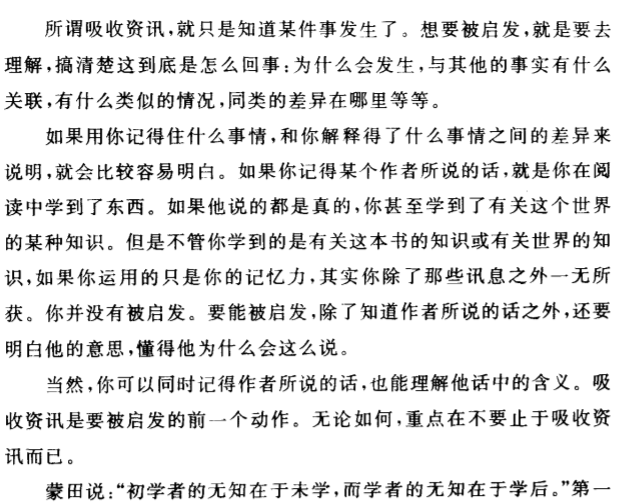

# 阅读的活力与艺术

> 新时代的传播媒体是否真的能增进我们对自己世界的了解？
>
> 太多咨询如同太少咨询一样，都是对理解力的阻碍
>
> 原因是：媒体经过太精心的设计，使得思想形同虚设

如何将知识分子的态度和观点包装起来，是当今最有才智的人正在做的事业之一

读者应该像棒球赛中的捕手

**阅读的目标：为获得咨询而读，以及为求得理解而读**

阅读艺术：凭借头脑的运作，以一己之力来提升自我的过程，头脑会从粗浅的了解推进到深入的理解

